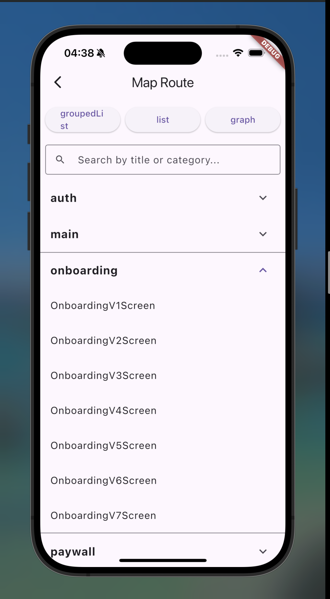
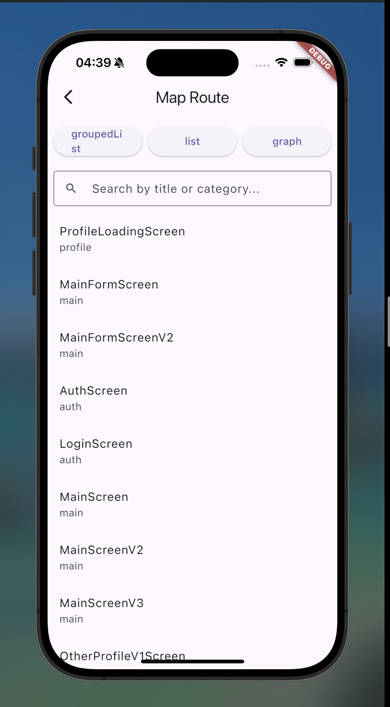
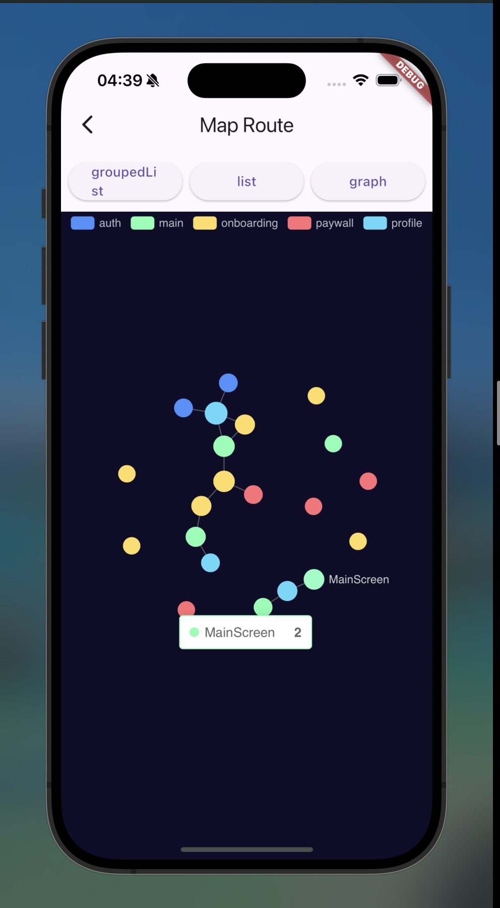

# map_route

A Flutter package for registering app routes and visualizing them as an interactive graph.

## Preview

<p float="left">
  
  
  
</p>

## Concepts

| Class | Description |
|---|---|
| `MRouteItem` | Wraps a screen, optionally with typed arguments |
| `MRouteEdge` | Connection between two route items |
| `MRouteRegistry` | Abstract class — declare all routes and edges here |
| `MapRouteScreen` | Visual navigator with list, grouped list, and graph views |

## Usage

**1. Define the registry**

```dart
class AppRouteRegistry extends MRouteRegistry {
  final home = MRouteItem<void, HomeScreen>.page(
    category: 'main',
    page: const HomeScreen(),
  );

  final profile = MRouteItem<ProfileArguments, ProfileScreen>(
    category: 'main',
    builder: (context, args) => ProfileScreen(args: args),
    createArguments: (context) async {
      // build and return MRouteGo(args) or null to cancel
      return MRouteGo(ProfileArguments(userId: '1'));
    },
  );

  @override
  List<MRouteItem<dynamic, Widget>> get routes => [home, profile];

  @override
  List<MRouteEdge> get edges => [
    MRouteEdge(home, profile),
  ];
}
```

**2. Open the map**

```dart
final registry = AppRouteRegistry();

MapRouteScreen(registry: registry).view(context);
```

**3. Limit visible views (optional)**

```dart
MapRouteScreen(
  registry: registry,
  views: [MViewType.graph],
)
```

## Edge helpers

```dart
// one → many
MRouteEdge.edgesFrom(home, [profile, settings])

// many → one
MRouteEdge.edgesTo([auth, login], profileLoading)
```
